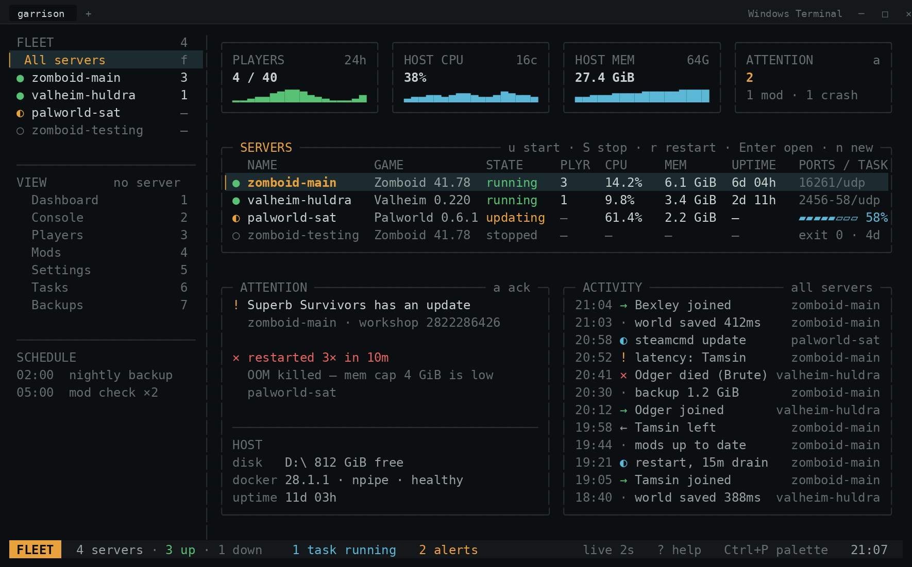

<h1 align="center">Garrison</h1>

<p align="center">
  <strong>A terminal dashboard for running game servers in Docker.</strong><br>
  One window for every server you own — Project Zomboid, Valheim, Palworld,<br>
  and whatever you install next month.
</p>

<p align="center">
  <a href="https://github.com/camden-brown/garrison/actions/workflows/ci.yml"></a>
  
  
  <a href="LICENSE"></a>
  
</p>

<p align="center">
  
</p>

<p align="center">
  <sub><b>Design mockup.</b> M0 is built — the Docker driver, the store and a working
  Fleet view with start/stop — so the servers table above is real; the tiles, attention
  pane and activity feed arrive with M1. See <a href="#roadmap">Roadmap</a>.</sub>
</p>

---

## Why

Standing up a game server is a `docker run` line. The annoying part is
everything after: re-learning each game's config format, re-deriving how to
read its logs, re-writing a restart script, and rebuilding somewhere to see
whether it is healthy — once per game, forever.

Garrison makes that work a plugin. A new game is **one Go package** that
declares its container plan, its settings, and how to read a line of its log.
The dashboard, console, task engine, settings form, mod manager and backup flow
are written once and work the same for every game.

## Features

- **Fleet view** — every server on one line: state, CPU, memory, who is
  connected, what task is running against it. State is encoded as a glyph, a
  colour *and* a word, so it reads at a glance and survives a 16-colour
  terminal.
- **Live dashboards** — CPU, memory and player sparklines at 1-second
  resolution, plus a fourth tile the game plugin supplies itself: zombies alive
  for Zomboid, world-save duration for Valheim.
- **Console with RCON** — classified log lines (chat, joins, saves, errors) and
  a command input that routes to RCON, to container stdin, or explains why
  neither is available. Repeated lines collapse to a `3×` counter so a
  crash-looping mod cannot erase your history.
- **Player tracking** — who is on now, seven days of sessions, and occupancy by
  hour so you can pick a restart window that bothers nobody.
- **Mod management** — load order that you can actually reorder, version and
  update checks, conflict detection, and correlation between a mod's changelog
  and the errors in your log.
- **A real task engine** — restarts, updates, mod syncs and backups are durable
  step sequences with declared rollback. A scheduled restart warns players,
  saves, snapshots the volume, updates, and restores the snapshot if the
  healthcheck fails.
- **Schema-driven settings** — a form generated from the game plugin's own
  field list, with impact badges (live / restart / recreate / wipe risk) and a
  literal config-file diff before anything is written.
- **A provisioner** — a wizard that turns "a game plus a name" into a running,
  port-mapped, volume-backed server. Ports are proposed by scanning the live
  fleet, so your second Valheim server does not collide with the first.
- **Ambient mode** — drops the chrome, enlarges everything to a card per
  server, slows refresh to 5 seconds. For the window you never close.

### What it is not

- **Not a web panel.** No HTTP server, no auth model, no browser. Remote access
  is SSH to the box and run the binary.
- **Not a Docker replacement.** Garrison stores no state Docker already holds.
  Containers are labelled `garrison.managed=1`, so the fleet is rediscoverable
  by listing containers — delete the config directory and it finds your servers
  again.
- **Not multi-user.** One operator, one machine.

## Getting started

### Prerequisites

- **Windows 10/11** with [Windows Terminal](https://aka.ms/terminal) — the
  status glyphs and block-element sparklines need its font handling
- **Docker Desktop**, reachable at `npipe:////./pipe/docker_engine`
- **Go 1.23+** to build (or use the container build below)

Linux and macOS should work — the code is portable and CI builds on Linux — but
Windows is the target and the only platform being tested by hand.

### Install

```console
git clone https://github.com/camden-brown/garrison.git
cd garrison
go build -o garrison.exe ./cmd/garrison
```

Go is fully supported on Windows: that produces a single native executable with
no runtime, no VM and no container.

<details>
<summary>Building without installing Go</summary>

Use a container as a *build step*, which is a different thing from running the
tool in one:

```console
docker run --rm -v "${PWD}:/src" -w /src \
  -e GOOS=windows -e GOARCH=amd64 \
  golang:1 go build -o garrison.exe ./cmd/garrison
```

The tool itself stays a normal Windows process, so it keeps the clipboard,
Credential Manager, and the ability to still be on screen while the Docker
daemon is restarting.
</details>

### Usage

```console
garrison                          # open the TUI
garrison status                   # one-line summary of every server
garrison restart zomboid-main --drain 15m
garrison backup zomboid-main --keep 14
```

The implemented commands are `garrison` (the TUI), `garrison status`,
`garrison version`, and `start`, `stop`, `restart`, `backup` and `update`,
each taking a server name. A subcommand submits the same task the key press
does and **waits for it**, printing each step and exiting non-zero if it
fails — a scheduled job that returned as soon as the task was queued would
tell Task Scheduler a restart succeeded before the server had stopped.
`--drain` is not implemented; drain itself is not.

The Docker endpoint is resolved from, in order: `--docker-endpoint`,
`GARRISON_DOCKER_HOST`, `DOCKER_HOST`, then the per-OS default
(`npipe:////./pipe/docker_engine` on Windows, `unix:///var/run/docker.sock`
elsewhere). `DOCKER_HOST` is honoured because a WSL2 shell or a rootless
install has usually already set it correctly. A bare path is accepted and
given a scheme, so `\\.\pipe\docker_engine` and `/var/run/docker.sock` both
work as written.

Every action in the TUI is also a subcommand, because the day you want one in
Task Scheduler you will want it badly. The TUI and the CLI are peers over the
same core; neither wraps the other.

### Configuration

```
%APPDATA%\Garrison\
  garrison.toml            # docker endpoint, data root, theme, intervals
  garrison.db              # SQLite: tasks, sessions, events, metrics, backups
  servers\<name>.toml      # one file per server — the whole state of it
```

Server files are human-readable TOML you can edit with the tool closed:

```toml
game    = "zomboid"
image   = "renegademaster/zomboid-dedicated-server:1.6.1"
data    = 'D:\gameservers\zomboid-main\data'
address = "myserver.example.org"   # what players type; only used by the share key

[resources]
memory = "12GiB"
cpus   = 8

[[ports]]
container = "16261/udp"
host      = 16261

[settings]                 # keys are the game's own, validated against its schema
MaxPlayers = 16
PVP        = false
PauseEmpty = true

[[mods]]                   # order in the file is the load order
id = "2822286426"
pin = "2.11.0"             # omit to track latest

[[schedule]]
kind   = "restart"
cron   = "0 2 * * *"
drain  = "15m"
policy = "skip-if-occupied"
```

Passwords do not go here — they live in Windows Credential Manager under
`garrison/<instance>/<key>`, so this directory is safe to sync or commit.

## Keybindings

Vim-adjacent where vim has an opinion, mnemonic where it does not. A key means
the same thing in every view or it does not exist. Lowercase is safe;
**uppercase is destructive** and always confirms.

| Key | Action |
| --- | --- |
| <kbd>1</kbd>–<kbd>7</kbd> | Dashboard, Console, Players, Mods, Settings, Tasks, Backups |
| <kbd>f</kbd> | Fleet view |
| <kbd>[</kbd> <kbd>]</kbd> | Previous / next server, keeping the current view |
| <kbd>Ctrl</kbd>+<kbd>P</kbd> | Fuzzy palette over servers, views and verbs |
| <kbd>:</kbd> | Command line — `:drain 15m`, `:mods add <id>` |
| <kbd>/</kbd> | Filter the current view |
| <kbd>Tab</kbd> | Cycle focus: servers → views → stage |
| <kbd>u</kbd> / <kbd>S</kbd> | Start / stop |
| <kbd>r</kbd> / <kbd>U</kbd> | Restart (offers a drain) / update |
| <kbd>b</kbd> / <kbd>B</kbd> | Backup now / restore |
| <kbd>y</kbd> | Copy the server's join details — address, password, world — to the clipboard |
| <kbd>n</kbd> / <kbd>X</kbd> | New server wizard / delete server |
| <kbd>F</kbd> | Ambient mode |
| <kbd>Space</kbd> | Freeze auto-refresh and log follow |
| <kbd>?</kbd> | Help overlay, generated from the live keymap |

## Supported games

The point of the table is the ragged right-hand side. These games agree on
almost nothing, and the UI does not care.

| | Zomboid | Valheim | Palworld |
| --- | :-: | :-: | :-: |
| Steam app id | `380870` | `896660` | `2394010` |
| Player list | RCON | log-derived | REST API |
| Console | RCON | — | RCON |
| Graceful drain | ✅ | partial | ✅ |
| Mods | Workshop | Thunderstore | — |
| Config files written | 2 | 0 (env) | 1 |

A game implementing none of the optional capabilities still gets a dashboard,
console, settings, tasks and backups — it just gets a Players view that
explains itself instead of an empty table.

## Architecture

Imports go one direction and never back:

```
model              leaf — shared types, imports nothing of ours
  ↑
games   host       describe vs. execute; neither imports the other
  ↑       ↑
tasks   services
  ↑
core               the store: one writer, immutable snapshots
  ↑
tui  ·  cmd        two peers, both consumers of core
```

Four goroutine families produce state concurrently — stats streams, log
streams, task steps, pollers — so none of them write shared structs. Each sends
a typed mutation on one channel; one goroutine applies them and publishes an
immutable snapshot. The TUI receives snapshots as messages and only renders.
There is exactly one mutex in the program and it lives in `internal/core`.

`internal/arch` enforces the dependency rule as a test, so it fails the build
instead of decaying into a comment. The rule that earns its keep is **`games`
must not import `host`**: a plugin describes the container it wants and never
builds one.

### Adding things

| To add | You write | You do not touch |
| --- | --- | --- |
| A game | `internal/games/<name>/` + a line in `games/all.go` | any view, the task engine, the settings form |
| A view | `internal/tui/views/<name>/` + a line in `views/all.go` | the shell, the rail, the keymap overlay |
| A task kind | a `Kind` and a `[]Step` builder | progress, cancellation, persistence, lanes |
| A setting | one `games.Field` in that game's `Schema()` | the form, validation, the diff, the confirm modal |
| A metric | `model.Event{Metric, Value}` from `Parse` | the metric rings, the sparkline, the tile |
| A runtime | one `host.Driver` implementation | everything above `internal/host` |

Reaching for a `switch` on a game's ID outside `internal/games` means a
capability interface is missing. That is the smell that matters most.

Full design — screens, keymap, pipelines, task engine, on-disk layout and
risks — is in **[`docs/DESIGN.md`](docs/DESIGN.md)**. The reasoning behind the
decisions that are expensive to reverse, including what was rejected and how
we would know each was wrong, is in
**[`docs/decisions/`](docs/decisions/)**.

## Development

```console
go build ./...                    # build everything
go test ./...                     # runs with Docker stopped
go vet ./...
gofmt -l .

GOOS=windows GOARCH=amd64 go build ./cmd/garrison
go test -tags integration ./...   # the one test that needs a real engine
```

The suite runs without Docker. Plugin functions are pure (table tests against
captured log fixtures in `testdata/`), store mutations are reducers, task steps
run against the fake `host.Driver` in `internal/host/fake`, and views get
golden renders at 120×34 and 80×24 with the colour profile pinned.

One test needs a real engine and is kept behind a build tag, so it never runs
by accident:

```console
go test -tags integration ./internal/host/docker
```

It creates a container from `alpine:3`, starts it, reads its logs and stats,
execs into it, then stops and removes it — checking that the assumptions the
fake encodes match the thing it stands in for.

## Roadmap

| | Milestone | |
| :-: | --- | --- |
| **M0** ✅ | Driver and fleet list | `host.Driver` over the named pipe, the store, start/stop. Named pipe verified against Docker Desktop; the render loop still wants an hour on Windows hardware. |
| **M1** ✅ | Live truth | Stats and log streaming, the dashboard with sparklines, Valheim behind the `Game` interface. |
| **M2** ✅ | Task engine | Lanes, steps, compensation, SQLite persistence, the Tasks view. Restart, backup, update, restore and the scheduler, plus the Console and Backups screens over them. |
| **M3** ◐ | Second game | The settings form and apply are built against Valheim. Zomboid — two config syntaxes, RCON, Workshop mods with load order — is next. |
| **M4** | Players and mods | Session history, occupancy, the Mods view. Palworld as the third game. |
| **M5** | Provisioning and polish | The wizard, restore, ambient mode, command palette, CLI subcommands, 80-column layouts. |

Valheim goes first deliberately: it is the simplest plugin and it has **no
RCON**, which forces log-derived player state early rather than letting the
design assume RCON exists.

## Contributing

It is early — the interfaces will move. If you want a game supported, opening
an issue with its config format, a sample of its server log, and whether it has
RCON is genuinely the most useful thing, because those three facts are most of
a plugin.

## License

[MIT](LICENSE)
